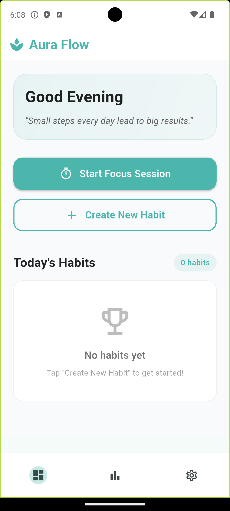
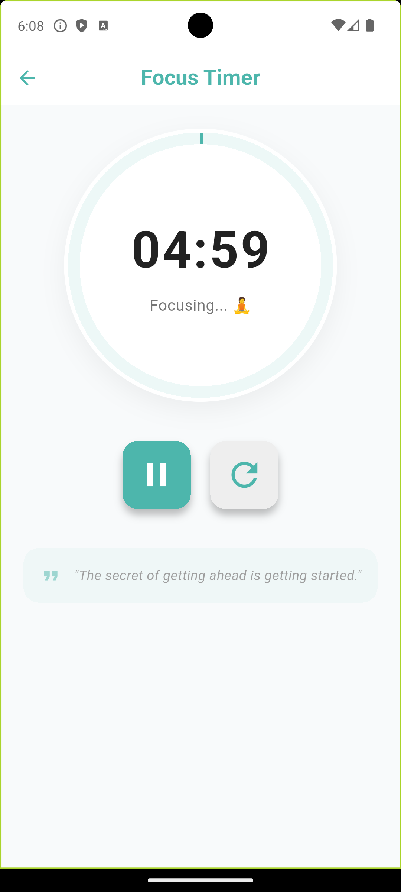
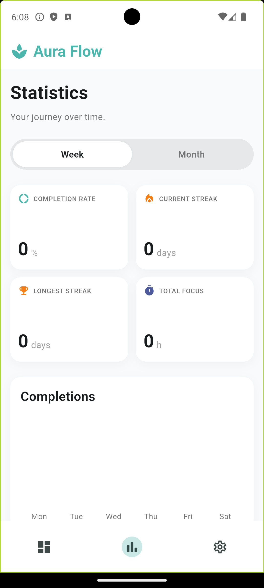

# 🌿 Aura Flow - Habit Tracker & Focus Timer

A minimalist, locally-persisted habit tracker with an integrated Pomodoro focus timer. Built with Flutter, focusing on clean UI, smooth interactions, and offline-first functionality.

## ✨ Features
- 📋 **Habit Tracking** – Create, complete, and track daily habits with streak counters
- ⏱️ **Focus Timer** – Built-in Pomodoro timer with session logging
- 🌙 **Light/Dark Mode** – System-aware theme switching
- 💾 **Offline-First** – All data persists locally using Hive
- 📊 **Stats & History** – View completion rates and focus logs
- 📱 **Responsive Layout** – Scroll-safe, constraint-aware widgets

## 🛠️ Tech Stack
- Flutter & Dart
- `flutter_riverpod` (state management)
- `hive` / `hive_flutter` (local persistence)
- `go_router` (navigation)
- `fl_chart` (data visualization)
- Material 3 theming

## 📸 Screenshots
| Dashboard | Focus Timer | Statistics |
|-----------|-------------|------------|
|  |  |  |

## 🚀 How to Run
```bash
flutter pub get
flutter run

## 📁 Project Structure
lib/
├── main.dart
├── models/
├── services/
├── providers/
├── screens/
├── widgets/
└── utils/

## 🤝 Contact
GitHub: https://github.com/alamin-omoyele/
LinkedIn: https://www.linkedin.com/in/al-amin-mohammed/
Email: alamin.omoyele@gmail.com